# Corporate Actions POC - MCP Platform

A collaborative data sharing platform for corporate actions that enables real-time access and transparency to market participants throughout the custody chain, implemented using the **Model Context Protocol (MCP)** with **Enhanced RAG capabilities and Dynamic Visualizations**.

## 🏗️ Architecture Overview

```mermaid
graph TB    
    %% Client Layer
    subgraph "Client Applications"
        UI[Streamlit Dashboard<br/>Enhanced Visualizations]
        AZURE_UI[Azure AI Streamlit<br/>Agent Service Integration]
        TEAMS[Microsoft Teams Bot<br/>MCP SSE Integration]
        CLAUDE[Claude Desktop<br/>MCP Integration]
    end

    %% MCP Protocol Layer
    subgraph "MCP Protocol Layer"
        MCP_STDIO[MCP stdio Transport<br/>Claude Desktop]
        MCP_HTTP[MCP HTTP Transport<br/>Streamlit Dashboard]
        MCP_SSE[MCP SSE Transport<br/>Teams Bot & Azure AI]
    end

    %% MCP Servers (Dual Mode)
    subgraph "MCP Servers (FastMCP + SSE)"
        RAG[Main RAG Server<br/>HTTP Port 8000 - SSE Port 8003<br/>6 Tools + Chat History]
        SEARCH[Web Search Server<br/>HTTP Port 8001 - SSE Port 8004<br/>4 Tools + News]
    end

    %% Azure Services
    subgraph "Azure Cloud Services"
        AOAI[Azure OpenAI<br/>GPT-4 + Embeddings<br/>Chat History Support]
        AISEARCH[Azure AI Search<br/>Vector Database<br/>Corporate Actions Index]
        COSMOS[Azure Cosmos DB<br/>Events + Comments<br/>Real-time Updates]
        AZURE_AI[Azure AI Agent Service<br/>MCP Tool Integration]
        BING[Bing Search API<br/>Financial News]
    end

    %% Data Layer
    subgraph "Data & Visualization"
        SAMPLE[Sample Data<br/>Corporate Actions]
        CHARTS[Dynamic Charts<br/>Plotly + Pandas]
        INSIGHTS[Color-coded Insights<br/>Status Indicators]
    end

    %% Client to Transport Connections
    UI --> MCP_HTTP
    AZURE_UI --> MCP_HTTP
    TEAMS --> MCP_SSE
    CLAUDE --> MCP_STDIO
    
    %% Transport to Server Connections
    MCP_HTTP --> RAG
    MCP_HTTP --> SEARCH
    MCP_HTTP --> COMMENTS
    MCP_SSE --> RAG
    MCP_SSE --> SEARCH
    MCP_SSE --> COMMENTS
    MCP_STDIO --> RAG
    
    %% Azure AI Integration
    AZURE_UI --> AZURE_AI
    AZURE_AI --> RAG
    AZURE_AI --> SEARCH
    AZURE_AI --> COMMENTS
    
    %% Server to Azure Service Connections
    RAG --> AOAI
    RAG --> AISEARCH
    RAG --> COSMOS
    RAG --> CHARTS
    
    SEARCH --> BING
    SEARCH --> AOAI
    
    COMMENTS --> COSMOS
    COMMENTS --> INSIGHTS
      %% Data Connections
    SAMPLE --> AISEARCH
    SAMPLE --> COSMOS

    %% Styling
    classDef clientClass fill:#e1f5fe,stroke:#01579b,stroke-width:2px
    classDef mcpClass fill:#f3e5f5,stroke:#4a148c,stroke-width:2px
    classDef serverClass fill:#e8f5e8,stroke:#1b5e20,stroke-width:2px
    classDef azureClass fill:#fff3e0,stroke:#e65100,stroke-width:2px
    classDef dataClass fill:#fce4ec,stroke:#880e4f,stroke-width:2px

    class UI,AZURE_UI,TEAMS,CLAUDE clientClass
    class MCP_STDIO,MCP_HTTP,MCP_SSE mcpClass
    class RAG,SEARCH,COMMENTS serverClass
    class AOAI,AISEARCH,COSMOS,AZURE_AI,BING azureClass
    class SAMPLE,CHARTS,INSIGHTS dataClass
```



### 🎯 Key Features & Enhancements

#### Enhanced RAG Assistant
- **Chat History Integration**: Maintains context across conversations (last 5 messages)
- **Dynamic Visualization**: Generates charts and graphs in real-time based on user queries
- **Intelligent Intent Detection**: Recognizes visualization requests and data analysis needs
- **Multi-modal Responses**: Combines text answers with interactive visualizations

#### Advanced Dashboard Capabilities  
- **Interactive Charts**: Pie charts, bar charts, timeline views using Plotly
- **Color-coded Status Indicators**: Visual status representation across all interfaces
- **Real-time Data Normalization**: Seamless handling of different data structures
- **Enhanced Search Visualizations**: Charts generated from search results

#### Cross-Platform Compatibility
- **Windows DNS Fixes**: Resolved `aiodns` selector event loop issues
- **Azure Service Integration**: Robust connection handling with fallback mechanisms

### Impact & Benefits
- **🎯 Improved User Experience**: Dashboard now correctly displays company names and handles date fields gracefully
- **🔧 Enhanced Reliability**: Better error handling prevents application crashes from data parsing issues  
- **📊 Better Data Visualization**: Timeline and analytics charts now work correctly with various data formats
- **🛠️ Improved Debugging**: Enhanced debug tools help identify and resolve data structure issues quickly

## 🏗️ Architecture Components

This POC leverages Azure Services and the Model Context Protocol to build an Agentic RAG (Retrieval-Augmented Generation) system with fully MCP-compliant servers.

### Core Services
- **Azure OpenAI**: LLM for natural language processing and response generation
- **Azure AI Search**: Vector database for RAG implementation
- **Azure Cosmos DB**: Transactional data storage for events and comments
- **Azure AI Agent Service**: Intelligent agent orchestration with MCP tool integration
- **Bing Search API**: Web search and financial news aggregation

### MCP Servers (Model Context Protocol Compliant) ✅

1. **Main RAG MCP Server** - **6 Enhanced Tools, 2 Resources** 🚀
   - **Advanced Agentic RAG** with chat history and context awareness
   - **Dynamic Visualization Engine** for real-time chart generation
   - **Multi-modal Response Generation** (text + visualizations)
   - **Enhanced Tools**:
     - `rag_query` - *Enhanced with chat history support and visualization detection*
     - `search_corporate_actions` - *Advanced filtering and data normalization*
     - `get_event_details` - *Enriched with comment integration*
     - `add_event_comment` - *Real-time collaboration features*
     - `get_service_health` - *Comprehensive Azure service monitoring*

2. **Web Search MCP Server** - **4 Enhanced Tools** 🌐
   - **Financial News Intelligence** with context-aware search
   - **Multi-source Data Aggregation** from Bing Search API
   - **Real-time Market Data** integration capabilities
   - **Enhanced Tools**:
     - `web_search` - *Corporate actions research with relevance scoring*
     - `news_search` - *Financial news with sentiment analysis*
     - `financial_data_search` - *Company symbol lookup with market data*
     - `get_search_health` - *API status and performance monitoring*

### Client Applications 🖥️

1. **Enhanced Streamlit UI** - *Port 8501* ⭐
   - **Dynamic Visualization Dashboard** with real-time chart generation
   - **Advanced RAG Assistant** with chat history and context awareness
   - **Interactive Search Interface** with color-coded results and insights
   - **MCP HTTP Transport**: Direct connection to MCP servers (ports 8000-8002)
   - **Enhanced Features**:
     - 📊 Real-time chart generation (pie, bar, timeline, summary dashboards)
     - 🎨 Color-coded status indicators and visual insights
     - 💬 Chat history maintenance and context-aware responses
     - 🔍 Advanced search with visualization suggestions
     - 📋 Data structure normalization for seamless Azure integration

2. **Azure AI Streamlit UI** - *Port 8502* 🤖
   - **Azure AI Agent Service Integration** with MCP tool discovery
   - **Intelligent Tool Orchestration** with automatic MCP tool registration
   - **Advanced Analytics Dashboard** with AI-generated insights
   - **MCP HTTP Transport**: Azure AI Agent manages MCP tool calls
   - **Enhanced Features**:
     - 🧠 AI-powered query processing and tool selection
     - 📊 Dynamic visualization generation based on AI analysis
     - 💬 Conversational interface with context awareness
     - 🔧 Real-time MCP tool discovery and registration

3. **Microsoft Teams Bot** - *Port 3978* 🚀
   - **Proactive Notifications** (market open/close alerts)
   - **MCP SSE Integration** using Server-Sent Events transport (ports 8003-8005)
   - **Real-time Data Streaming** with enhanced responsiveness
   - **Enhanced Features**:
     - 🌊 SSE endpoints for low-latency communication
     - 📱 Native Teams integration without Azure Bot Service dependency
     - 🔔 Intelligent notification service with market event triggers
     - 💬 Natural language processing with MCP-powered RAG
   - **MCP-powered Natural Language** queries with visualization support
   - **Subscription Management** for symbols and events

## 🚀 Quick Start

### Prerequisites
- Python 3.8+
- Model Context Protocol (MCP) support
- Azure subscription with the following services:
  - Azure OpenAI
  - Azure AI Search
  - Azure Cosmos DB
  - Azure Bot Service (for Teams integration)

### Installation

1. **Clone the repository**
   ```bash
   git clone <repository-url>
   cd corporateactions
   ```

2. **Install MCP dependencies**
   ```bash
   pip install mcp fastmcp
   ```

3. **Install server-specific dependencies**
   ```bash
   # Main RAG server
   cd mcp-rag
   pip install -r requirements.txt
   cd ..
   
   # Web search server
   cd mcp-websearch
   pip install -r requirements.txt
   cd ..
   
   ```

4. **Configure environment variables**
   Create a `.env` file in the root directory:
   ```env
   # Azure OpenAI Configuration
   AZURE_OPENAI_ENDPOINT=https://your-openai-resource.openai.azure.com/
   AZURE_OPENAI_KEY=your-openai-api-key
   AZURE_OPENAI_DEPLOYMENT_NAME=gpt-4
   AZURE_OPENAI_EMBEDDING_DEPLOYMENT_NAME=text-embedding-ada-002
   
   # Azure AI Search Configuration
   AZURE_SEARCH_ENDPOINT=https://your-search-service.search.windows.net
   AZURE_SEARCH_KEY=your-search-admin-key
   AZURE_SEARCH_INDEX_NAME=corporateactions
   
   # Azure Cosmos DB Configuration
   AZURE_COSMOS_ENDPOINT=https://your-cosmos-account.documents.azure.com:443/
   AZURE_COSMOS_KEY=your-cosmos-primary-key
   
   # Optional: Bing Search API for enhanced web search
   BING_SEARCH_API_KEY=your-bing-search-api-key
   ```

5. **Test MCP servers**
   ```bash
   python test_mcp_servers.py
   ```

6. **Start all MCP servers (choose mode)**
   ```bash
   # Start in MCP HTTP mode (for Streamlit UIs and Claude Desktop)
   python start_mcp_servers.py
   
   # OR start in SSE mode (for Teams Bot)
   python start_mcp_servers.py --sse
   ```

### Alternative: Start Individual Servers

You can start each MCP server individually in either mode:

#### MCP HTTP Mode (Ports 8000-8002)
```bash
# Main RAG server (MCP HTTP)
cd mcp-rag
python main.py --port 8000

# Web search server (MCP HTTP)
cd mcp-websearch  
python main.py --port 8001

```

#### SSE Mode (Ports 8003-8005)
```bash
# Main RAG server (SSE)
cd mcp-rag
python main.py --sse --port 8003

# Web search server (SSE)
cd mcp-websearch  
python main.py --sse --port 8004

```

## 🛠️ Enhanced MCP Tools & Capabilities

### Main RAG Server Tools (Enhanced) 🚀
- **`rag_query`** ⭐: *Enhanced with chat history and dynamic visualization*
  - Process natural language queries with conversation context
  - **NEW**: Chat history integration (last 5 messages for context)
  - **NEW**: Dynamic visualization detection and generation
  - **NEW**: Multi-modal responses (text + interactive charts)
  - Returns: JSON with answer, sources, confidence, visualization suggestions

- **`search_corporate_actions`**: *Advanced filtering and data normalization*
  - Search events by type, symbol, date, status with enhanced filters
  - **NEW**: Automatic data structure normalization (`issuer_name` ↔ `company_name`)
  - **NEW**: Enhanced result formatting for visualization compatibility

- **`get_event_details`**: *Enriched with comment integration*
  - Get comprehensive event information with related comments
  - **NEW**: Auto-inclusion of recent comments and Q&A threads

- **`add_event_comment`**: *Real-time collaboration features*
  - Add comments, questions, concerns with categorization
  - **NEW**: Enhanced comment types and resolution tracking

- **`get_service_health`**: *Comprehensive Azure monitoring*
  - Check health of all Azure services with detailed diagnostics
  - **NEW**: Windows compatibility checks and DNS status

### Web Search Server Tools (Enhanced) 🌐
- **`web_search`**: *Corporate actions research with relevance scoring*
  - General web search optimized for financial content
  - **NEW**: Enhanced result filtering and relevance scoring

- **`news_search`**: *Financial news with contextual intelligence*
  - Search recent financial news with corporate actions focus
  - **NEW**: Sentiment analysis and trend detection capabilities

- **`financial_data_search`**: *Company data with market integration*
  - Search financial data by company symbol with real-time updates
  - **NEW**: Enhanced data enrichment and cross-reference capabilities

- **`get_search_health`**: *API monitoring and performance tracking*
  - Check search service health with comprehensive diagnostics

## 🎨 Dynamic Visualization Capabilities

### Real-time Chart Generation 📊
The enhanced RAG assistant can now generate visualizations dynamically based on user queries:

```python
# Examples of visualization requests that trigger dynamic generation:
"Show me a chart of dividend status distribution"
"Create a bar chart of event types"  
"Visualize the most active companies"
"Generate a timeline of corporate actions"
"Display a pie chart of event status"
```

### Supported Visualization Types 📈
- **Status Distribution Pie Charts**: Color-coded event status breakdowns
- **Event Type Bar Charts**: Horizontal/vertical bar charts for event categories
- **Company Activity Charts**: Most active issuers and event frequency
- **Timeline Visualizations**: Time-series analysis of corporate actions
- **Summary Dashboards**: Multi-chart overview with key insights
- **Financial Data Charts**: Dividend amounts, ratios, and financial metrics

### Visualization Features ✨
- **Smart Detection**: Automatically recognizes visualization requests in natural language
- **Dynamic Generation**: Creates charts in real-time using Plotly and Pandas
- **Interactive Elements**: Zoom, hover, filter capabilities in generated charts
- **Color Coding**: Consistent color schemes across all visualizations
- **Responsive Design**: Charts adapt to different screen sizes and containers

## 🔗 Enhanced MCP Client Integration

The enhanced MCP servers support advanced client integration with visualization and chat history capabilities:

### Basic RAG Query with Visualization Support
```python
from mcp import ClientSession
from mcp.client.stdio import stdio_client

# Connect to enhanced RAG server
async with stdio_client(["python", "mcp-rag/main.py"]) as (read, write):
    async with ClientSession(read, write) as session:
        # Initialize the session
        await session.initialize()
        
        # Enhanced RAG query with chat history and visualization detection
        result = await session.call_tool("rag_query", {
            "query": "Show me a pie chart of dividend payment status",
            "max_results": 10,
            "chat_history": json.dumps([
                {"role": "user", "content": "What are recent dividends?"},
                {"role": "assistant", "content": "I found several recent dividend announcements..."}
            ])
        })
        
        response = json.loads(result.content)
        print(f"Answer: {response['answer']}")
        print(f"Requires Visualization: {response['requires_visualization']}")
        print(f"Suggested Charts: {response.get('visualization_suggestions', {})}")
```

### Advanced Search with Data Normalization
```python
# Search with enhanced filtering and normalization
search_result = await session.call_tool("search_corporate_actions", {
    "search_text": "dividend Apple Microsoft",
    "event_type": "dividend", 
    "status": "confirmed",
    "date_from": "2024-01-01",
    "limit": 20
})

events = json.loads(search_result.content)
# Data is automatically normalized for consistent field names
for event in events['events']:
    print(f"Company: {event['company_name']}")  # Normalized field
    print(f"Status: {event['status']}")
```

### Comments Analytics with Enhanced Insights
```python
# Get advanced comment analytics
analytics_result = await session.call_tool("get_comment_analytics", {
    "event_id": "AAPL_DIV_2024_Q1",
    "days_back": 30
})

analytics = json.loads(analytics_result.content)
print(f"Total Comments: {analytics['summary']['total_comments']}")
print(f"Resolution Rate: {analytics['summary']['resolution_rate']}%")
print(f"Top Contributors: {analytics['organizations']['top_contributors']}")
```

### Streamlit Client Integration (Enhanced)
```python
from clients.streamlit_ui.app_mcp import SimpleMCPClient

# Enhanced MCP client with visualization support
client = SimpleMCPClient()

# RAG query with chat history
chat_history = [
    {"role": "user", "content": "Tell me about recent dividends"},
    {"role": "assistant", "content": "Here are the recent dividend announcements..."}
]

response = client.rag_query(
    query="Create a visualization of dividend amounts by company",
    max_results=10,
    chat_history=chat_history
)

# Check if visualization is needed and generate dynamic charts
if response.get("requires_visualization"):
    # Dynamic visualization generation happens automatically in Streamlit UI
    print("Visualization will be generated in the interface")
```

## 📊 Data Models

The platform uses standardized schemas for corporate actions:

- **CorporateActionEvent**: Main event data structure
- **UserComment**: Comments and Q&A system
- **EventSearchQuery**: Search parameters and filters
- **Security**: Stock/bond identification information

See `data-models/corporate_action_schemas.py` for complete schemas.

## 🗂️ Enhanced Project Structure

```
corporateactions/
├── mcp-rag/                    # Enhanced RAG MCP server ⭐
│   ├── main.py                   # FastMCP with advanced RAG + visualizations + SSE
│   └── requirements.txt          # MCP + Azure + ML dependencies
├── mcp-websearch/                # Enhanced web search MCP server 🌐
│   ├── main.py                   # FastMCP with intelligent search tools + SSE
│   └── requirements.txt          # MCP + search + analytics dependencies  
├── data-models/                  # Shared data schemas & normalization 📊
│   ├── corporate_action_schemas.py # Enhanced schemas with visualization support
│   └── sample_data.py           # Rich sample data for testing
├── clients/                      # Enhanced client applications 🖥️
│   ├── streamlit-ui/            # Advanced dashboard with dynamic visualizations ⭐
│   │   ├── app_mcp.py          # Enhanced MCP client with chat history + viz
│   │   ├── app.py              # Legacy dashboard (maintained for reference)
│   │   └── requirements.txt    # Streamlit + Plotly + visualization libs
│   ├── streamlit-azure-ai/      # Azure AI Agent Service integration 🤖
│   │   ├── app.py              # Azure AI Agent with MCP tool discovery
│   │   ├── azure_mcp_tools.py  # MCP tool registry and execution
│   │   ├── start-azure-ai-app.ps1 # PowerShell startup script
│   │   ├── test_azure_ai_agent.py # Azure AI Agent testing
│   │   └── requirements.txt    # Azure AI + MCP dependencies
│   ├── corporate-actions-agent/ # Enhanced Teams bot with MCP SSE integration 🚀
│   │   ├── src/
│   │   │   ├── bot.ts          # Teams bot with MCP SSE integration
│   │   │   ├── index.ts        # Application entry point
│   │   │   └── services/
│   │   │       ├── mcpClientManager.ts # SSE client manager
│   │   │       ├── notificationService.ts # Proactive notifications
│   │   │       └── adaptiveCards.ts # Teams card formatting
│   │   ├── appPackage/         # Teams app manifest and assets
│   │   ├── package.json        # Node.js dependencies
│   │   ├── INTEGRATION_STATUS.md # Current integration status
│   │   └── README.md           # Teams bot documentation
│   └── teams-bot/              # Alternative Python Teams bot (legacy) 
│       ├── bot.py              # Python Teams bot with MCP stdio
│       ├── manifest.json       # Teams app manifest
│       └── requirements.txt    # Bot framework + MCP dependencies
├── scripts/                     # Enhanced utility scripts 🔧
│   ├── data_ingestion.py       # Azure data setup with Windows compatibility
│   ├── deploy_azure.ps1        # Azure deployment automation
│   ├── start_services.ps1      # Windows service startup scripts
│   └── requirements.txt        # Script dependencies
├── start_mcp_servers.py         # Enhanced multi-server startup script (dual mode)
├── start_all_services.ps1       # PowerShell service orchestration
├── manual_start_commands.ps1    # Manual server startup commands
├── requirements.txt             # Root dependencies
└── README.md                    # This enhanced documentation
```

### Key Enhancements by Directory 🎯

#### `/mcp-rag/` - Advanced RAG Capabilities + SSE Support
- ✅ **Chat History Integration**: Context-aware conversations
- ✅ **Dynamic Visualization Detection**: Smart chart generation triggers
- ✅ **Multi-modal Responses**: Text + interactive visualizations
- ✅ **Data Normalization**: Seamless field mapping and compatibility
- ✅ **Windows Compatibility**: DNS and event loop fixes
- ✅ **Dual Transport Mode**: Both MCP HTTP (port 8000) and SSE (port 8003)

#### `/clients/streamlit-ui/` - Enhanced Dashboard
- ✅ **Real-time Chart Generation**: Plotly-based dynamic visualizations
- ✅ **Color-coded Insights**: Visual status indicators and themes
- ✅ **Interactive Search Interface**: Enhanced filtering with visual results
- ✅ **Chat History UI**: Conversation context and regeneration capabilities
- ✅ **Responsive Design**: Adaptive layouts for different screen sizes
- ✅ **MCP HTTP Integration**: Direct connection to MCP servers

#### `/clients/streamlit-azure-ai/` - Azure AI Agent Service
- ✅ **Azure AI Agent Integration**: Intelligent tool orchestration
- ✅ **Dynamic MCP Tool Discovery**: Automatic tool registration
- ✅ **AI-Powered Insights**: Smart analysis and recommendations
- ✅ **PowerShell Automation**: Enhanced startup and monitoring scripts
- ✅ **Field Normalization Fixes**: Resolved "Unknown Company" issues
- ✅ **Date Parsing Improvements**: Fixed analytics visualization errors

#### `/clients/corporate-actions-agent/` - Teams Bot with SSE
- ✅ **TypeScript Implementation**: Modern, type-safe development
- ✅ **MCP SSE Integration**: Low-latency Server-Sent Events transport
- ✅ **Proactive Notifications**: Market event triggers and alerts
- ✅ **Advanced Card Formatting**: Rich Teams adaptive cards
- ✅ **No Azure Bot Service Dependency**: Direct Teams integration
- ✅ **Real-time Data Streaming**: Enhanced responsiveness

#### `/data-models/` - Enhanced Data Handling
- ✅ **Schema Flexibility**: Support for multiple data structure variants
- ✅ **Visualization Schema**: Chart configuration and suggestion models
- ✅ **Normalization Functions**: Automatic field mapping utilities
- ✅ **Rich Sample Data**: 100+ events with diverse attributes for testing

## 🧪 Enhanced Testing & Validation

### Comprehensive MCP Server Testing
```powershell
# Test all enhanced MCP servers and capabilities
python test_mcp_servers.py
```

This enhanced test suite validates:
- ✅ **MCP Dependencies**: FastMCP, official MCP SDK installation
- ✅ **Azure Service Configuration**: OpenAI, AI Search, Cosmos DB connectivity
- ✅ **Enhanced Server Capabilities**: Chat history, visualization detection
- ✅ **Tool Availability**: All 17 enhanced tools across 3 servers
- ✅ **Windows Compatibility**: DNS resolution and event loop configuration
- ✅ **Data Normalization**: Field mapping and structure compatibility

## 🚀 Enhanced Deployment Guide

### Local Development (Windows PowerShell) 🪟

#### Option 1: Automated Startup (Recommended)
```powershell
# Start all services with automated orchestration
.\start_all_services.ps1

# This will start:
# - All MCP servers in appropriate mode
# - Streamlit UI applications
# - Optional Teams bot
```

#### Option 2: Manual Startup with PowerShell Scripts
```powershell
# 1. Start MCP servers (choose transport mode)
python start_mcp_servers.py          # MCP HTTP mode (ports 8000-8002)
# OR
python start_mcp_servers.py --sse     # SSE mode (ports 8003-8005)

# 2. Start Streamlit applications
cd clients/streamlit-ui
streamlit run app_mcp.py --server.port 8501

# Start Azure AI Streamlit application
cd ../streamlit-azure-ai
.\start-azure-ai-app.ps1 --Port 8502

# 3. Start Teams bot (optional)
cd ../corporate-actions-agent
npm run dev
```

#### Option 3: Individual Commands (Development)
```powershell
# Use pre-defined manual commands
.\manual_start_commands.ps1

# This shows all individual startup commands for each service
# Copy and run them in separate PowerShell windows
```

### Quick Start Commands (Windows)
```powershell
# Install all dependencies
pip install -r requirements.txt
pip install -r clients/streamlit-ui/requirements.txt
pip install -r clients/streamlit-azure-ai/requirements.txt

# Set up environment with Azure credentials
copy .env.example .env
# Edit .env with your Azure service credentials

# Start everything with automation
.\start_all_services.ps1

# OR start manually in order:
python start_mcp_servers.py
cd clients/streamlit-ui ; streamlit run app_mcp.py --server.port 8501
cd ../streamlit-azure-ai ; .\start-azure-ai-app.ps1
```

### Service URLs (After Startup)
- **🏠 Streamlit Dashboard**: http://localhost:8501
- **🤖 Azure AI Dashboard**: http://localhost:8502  
- **📡 MCP RAG Server**: http://localhost:8000/mcp
- **🔍 MCP Web Search**: http://localhost:8001/mcp
- **🌊 SSE RAG Server**: http://localhost:8003/health
- **🌊 SSE Web Search**: http://localhost:8004/health

### Azure Deployment (Production Ready)
```powershell
# Deploy Azure infrastructure with enhanced monitoring
./scripts/deploy_azure.ps1

# Set up data ingestion with Windows compatibility
python scripts/data_ingestion.py

# Configure enhanced application settings
# Update .env with deployed resource endpoints
# Enable visualization dependencies in Azure App Service
```

## 📝 Enhanced API Documentation & Examples

### Interactive API Documentation & Health Endpoints

#### MCP HTTP Servers (Ports 8000-8002)
- **Main RAG Server**: http://localhost:8000/mcp *(MCP protocol endpoint)*
- **Web Search Server**: http://localhost:8001/mcp *(MCP protocol endpoint)*  

#### SSE Servers (Ports 8003-8005) - For Teams Bot Integration
- **RAG Server Health**: http://localhost:8003/health
- **RAG Query**: `GET http://localhost:8003/rag-query?query=<query>`
- **Search Health**: http://localhost:8004/health  
- **Web Search**: `GET http://localhost:8004/web-search?query=<query>`

#### Azure AI Agent Service Integration
- **Tool Discovery**: Automatic MCP tool registration
- **Intelligent Orchestration**: Context-aware tool selection
- **Enhanced Analytics**: AI-powered insights and visualization suggestions

### Example Queries & Expected Responses

#### Enhanced RAG with Visualization
```python
# Input Query
"Show me a pie chart of corporate action status distribution for tech companies"

# Enhanced Response Structure
{
    "answer": "I found several corporate actions for tech companies. Here's the breakdown...",
    "sources": [...],  # Corporate action events
    "confidence_score": 0.92,
    "query_intent": "visualization",
    "requires_visualization": true,
    "visualization_suggestions": {
        "recommended_charts": ["status_distribution_pie", "company_activity_bar"],
        "data_available": ["event_status", "company_activity", "event_types"]
    }
}
```
