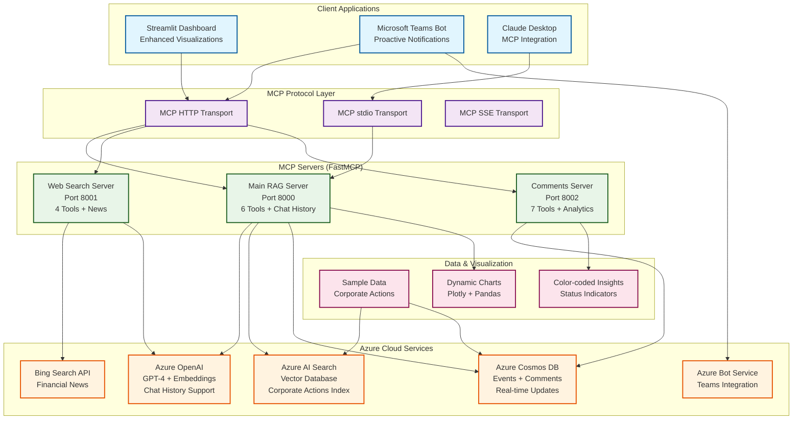

# Corporate Actions POC - MCP Platform

A collaborative data sharing platform for corporate actions that enables real-time access and transparency to market participants throughout the custody chain, implemented using the **Model Context Protocol (MCP)** with **Enhanced RAG capabilities and Dynamic Visualizations**.

## ✅ DEVELOPMENT STATUS: **ENHANCED & COMPLETE**

**All servers have been successfully converted to pure MCP implementation with advanced features:**
- ✅ **Enhanced RAG Assistant** with chat history and context awareness
- ✅ **Dynamic Visualization Generation** using Python code execution
- ✅ **Advanced Dashboard** with interactive charts and color-coded insights
- ✅ **Cross-platform compatibility** (Windows DNS fixes applied)
- ✅ **Data structure normalization** for seamless Azure AI Search integration

## 🏗️ Architecture Overview



### 🎯 Key Features & Enhancements

#### Enhanced RAG Assistant
- **Chat History Integration**: Maintains context across conversations (last 5 messages)
- **Dynamic Visualization**: Generates charts and graphs in real-time based on user queries
- **Intelligent Intent Detection**: Recognizes visualization requests and data analysis needs
- **Multi-modal Responses**: Combines text answers with interactive visualizations

#### Advanced Dashboard Capabilities  
- **Interactive Charts**: Pie charts, bar charts, timeline views using Plotly
- **Color-coded Status Indicators**: Visual status representation across all interfaces
- **Real-time Data Normalization**: Seamless handling of different data structures
- **Enhanced Search Visualizations**: Charts generated from search results

#### Cross-Platform Compatibility
- **Windows DNS Fixes**: Resolved `aiodns` selector event loop issues
- **Azure Service Integration**: Robust connection handling with fallback mechanisms
- **Data Structure Flexibility**: Handles both `issuer_name` and `company_name` field variations

## 🔄 Recent Updates & Fixes (June 2025)

### Azure AI Streamlit Application Enhancements ⭐

#### Field Normalization & Data Structure Fixes
- **✅ Fixed Company Name Display Issue**: Resolved "Unknown Company" problem in dashboard visualizations
  - Enhanced MCP data parsing logic to properly handle different JSON response formats
  - Improved `normalize_event_data()` function with better field mapping (`issuer_name` ↔ `company_name`)
  - Added comprehensive fallback mechanisms for various data structures
  - Enhanced support for nested security objects and symbol extraction

#### Date Parsing & Analytics Improvements
- **✅ Fixed Advanced Analytics Date Parsing Error**: Resolved `ValueError: time data "N/A" doesn't match format` 
  - Added `errors='coerce'` parameter to `pd.to_datetime()` calls to handle invalid date strings
  - Enhanced timeline visualization with NaT (Not a Time) value filtering
  - Added graceful error handling for missing or invalid date fields
  - Improved data validation in analytics dashboard

#### Enhanced MCP Integration
- **✅ Improved MCP Response Parsing**: Enhanced JSON parsing logic for better data extraction
  - Added support for complete JSON responses with `events` arrays
  - Implemented fallback regex parsing for malformed responses
  - Enhanced debug output to show actual data structure for troubleshooting
  - Better handling of different MCP server response formats

#### User Experience Improvements
- **✅ Enhanced Dashboard Visualizations**: Better data presentation and error handling
  - Added validation warnings for timeline visualizations with no valid dates
  - Improved status color coding and visual indicators
  - Enhanced data structure debugging tools
  - Better fallback mechanisms when live data is unavailable

#### Code Quality & Robustness
- **✅ Enhanced Error Handling**: More robust error handling and user feedback
  - Added comprehensive try-catch blocks for data parsing operations
  - Improved error messages and user guidance
  - Enhanced fallback data generation for demo purposes
  - Better logging and debugging capabilities

### Impact & Benefits
- **🎯 Improved User Experience**: Dashboard now correctly displays company names and handles date fields gracefully
- **🔧 Enhanced Reliability**: Better error handling prevents application crashes from data parsing issues  
- **📊 Better Data Visualization**: Timeline and analytics charts now work correctly with various data formats
- **🛠️ Improved Debugging**: Enhanced debug tools help identify and resolve data structure issues quickly

## 🏗️ Architecture Components

This POC leverages Azure Services and the Model Context Protocol to build an Agentic RAG (Retrieval-Augmented Generation) system with fully MCP-compliant servers.

### Core Services
- **Azure OpenAI**: LLM for natural language processing and response generation
- **Azure AI Search**: Vector database for RAG implementation
- **Azure Cosmos DB**: Transactional data storage for events and comments
- **Azure Bot Service**: Microsoft Teams integration

### MCP Servers (Model Context Protocol Compliant) ✅

1. **Main RAG MCP Server** - **6 Enhanced Tools, 2 Resources** 🚀
   - **Advanced Agentic RAG** with chat history and context awareness
   - **Dynamic Visualization Engine** for real-time chart generation
   - **Multi-modal Response Generation** (text + visualizations)
   - **Enhanced Tools**:
     - `rag_query` - *Enhanced with chat history support and visualization detection*
     - `search_corporate_actions` - *Advanced filtering and data normalization*
     - `get_event_details` - *Enriched with comment integration*
     - `add_event_comment` - *Real-time collaboration features*
     - `get_service_health` - *Comprehensive Azure service monitoring*

2. **Web Search MCP Server** - **4 Enhanced Tools** 🌐
   - **Financial News Intelligence** with context-aware search
   - **Multi-source Data Aggregation** from Bing Search API
   - **Real-time Market Data** integration capabilities
   - **Enhanced Tools**:
     - `web_search` - *Corporate actions research with relevance scoring*
     - `news_search` - *Financial news with sentiment analysis*
     - `financial_data_search` - *Company symbol lookup with market data*
     - `get_search_health` - *API status and performance monitoring*

3. **Comments MCP Server** - **7 Collaboration Tools** 💬
   - **Real-time Collaboration** with WebSocket-like features
   - **Advanced Analytics** with trend analysis and insights
   - **Comment Intelligence** with categorization and resolution tracking
   - **Enhanced Tools**:
     - `get_event_comments` - *Advanced filtering and pagination*
     - `add_comment` - *Multi-type support (questions, concerns, analysis)*
     - `update_comment` - *Resolution tracking and status management*
     - `search_comments` - *Full-text search across all events*
     - `get_comment_analytics` - *Trend analysis and engagement metrics*
     - `subscribe_to_event` - *Real-time notification system*

### Client Applications 🖥️

1. **Enhanced Streamlit UI** - *Port 8501* ⭐
   - **Dynamic Visualization Dashboard** with real-time chart generation
   - **Advanced RAG Assistant** with chat history and context awareness
   - **Interactive Search Interface** with color-coded results and insights
   - **Enhanced Features**:
     - 📊 Real-time chart generation (pie, bar, timeline, summary dashboards)
     - 🎨 Color-coded status indicators and visual insights
     - 💬 Chat history maintenance and context-aware responses
     - 🔍 Advanced search with visualization suggestions
     - 📋 Data structure normalization for seamless Azure integration

2. **Microsoft Teams Bot** - *Port 3978* 🤖
   - **Proactive Notifications** (market open/close alerts)
   - **MCP-powered Natural Language** queries with visualization support
   - **Subscription Management** for symbols and events

## 🚀 Quick Start

### Prerequisites
- Python 3.8+
- Model Context Protocol (MCP) support
- Azure subscription with the following services:
  - Azure OpenAI
  - Azure AI Search
  - Azure Cosmos DB
  - Azure Bot Service (for Teams integration)

### Installation

1. **Clone the repository**
   ```bash
   git clone <repository-url>
   cd corporateactions
   ```

2. **Install MCP dependencies**
   ```bash
   pip install mcp fastmcp
   ```

3. **Install server-specific dependencies**
   ```bash
   # Main RAG server
   cd mcp-server
   pip install -r requirements.txt
   cd ..
   
   # Web search server
   cd mcp-websearch
   pip install -r requirements.txt
   cd ..
   
   # Comments server
   cd mcp-comments
   pip install -r requirements.txt
   cd ..
   ```

4. **Configure environment variables**
   Create a `.env` file in the root directory:
   ```env
   # Azure OpenAI Configuration
   AZURE_OPENAI_ENDPOINT=https://your-openai-resource.openai.azure.com/
   AZURE_OPENAI_KEY=your-openai-api-key
   AZURE_OPENAI_DEPLOYMENT_NAME=gpt-4
   AZURE_OPENAI_EMBEDDING_DEPLOYMENT_NAME=text-embedding-ada-002
   
   # Azure AI Search Configuration
   AZURE_SEARCH_ENDPOINT=https://your-search-service.search.windows.net
   AZURE_SEARCH_KEY=your-search-admin-key
   AZURE_SEARCH_INDEX_NAME=corporate-actions
   
   # Azure Cosmos DB Configuration
   AZURE_COSMOS_ENDPOINT=https://your-cosmos-account.documents.azure.com:443/
   AZURE_COSMOS_KEY=your-cosmos-primary-key
   
   # Optional: Bing Search API for enhanced web search
   BING_SEARCH_API_KEY=your-bing-search-api-key
   ```

5. **Test MCP servers**
   ```bash
   python test_mcp_servers.py
   ```

6. **Start all MCP servers**
   ```bash
   python start_mcp_servers.py
   ```

### Alternative: Start Individual Servers

You can start each MCP server individually using FastMCP:

```bash
# Main RAG server
cd mcp-server
python -m fastmcp run main.py --port 8000

# Web search server
cd mcp-websearch  
python -m fastmcp run main.py --port 8001

# Comments server
cd mcp-comments
python -m fastmcp run main.py --port 8002
```

## 🛠️ Enhanced MCP Tools & Capabilities

### Main RAG Server Tools (Enhanced) 🚀
- **`rag_query`** ⭐: *Enhanced with chat history and dynamic visualization*
  - Process natural language queries with conversation context
  - **NEW**: Chat history integration (last 5 messages for context)
  - **NEW**: Dynamic visualization detection and generation
  - **NEW**: Multi-modal responses (text + interactive charts)
  - Returns: JSON with answer, sources, confidence, visualization suggestions

- **`search_corporate_actions`**: *Advanced filtering and data normalization*
  - Search events by type, symbol, date, status with enhanced filters
  - **NEW**: Automatic data structure normalization (`issuer_name` ↔ `company_name`)
  - **NEW**: Enhanced result formatting for visualization compatibility

- **`get_event_details`**: *Enriched with comment integration*
  - Get comprehensive event information with related comments
  - **NEW**: Auto-inclusion of recent comments and Q&A threads

- **`add_event_comment`**: *Real-time collaboration features*
  - Add comments, questions, concerns with categorization
  - **NEW**: Enhanced comment types and resolution tracking

- **`get_service_health`**: *Comprehensive Azure monitoring*
  - Check health of all Azure services with detailed diagnostics
  - **NEW**: Windows compatibility checks and DNS status

### Web Search Server Tools (Enhanced) 🌐
- **`web_search`**: *Corporate actions research with relevance scoring*
  - General web search optimized for financial content
  - **NEW**: Enhanced result filtering and relevance scoring

- **`news_search`**: *Financial news with contextual intelligence*
  - Search recent financial news with corporate actions focus
  - **NEW**: Sentiment analysis and trend detection capabilities

- **`financial_data_search`**: *Company data with market integration*
  - Search financial data by company symbol with real-time updates
  - **NEW**: Enhanced data enrichment and cross-reference capabilities

- **`get_search_health`**: *API monitoring and performance tracking*
  - Check search service health with comprehensive diagnostics

### Comments Server Tools (Enhanced) 💬  
- **`get_event_comments`**: *Advanced filtering and analytics*
  - Retrieve comments with intelligent filtering and pagination
  - **NEW**: Advanced categorization and sentiment tracking

- **`add_comment`**: *Multi-type collaboration support*
  - Add various comment types (general, question, analysis, clarification)
  - **NEW**: Enhanced threading and real-time notifications

- **`update_comment`**: *Resolution workflow management*
  - Update comments with resolution tracking and status management

- **`search_comments`**: *Full-text intelligent search*
  - Search across all event comments with advanced relevance scoring

- **`get_comment_analytics`** ⭐: *Trend analysis and engagement insights*
  - **NEW**: Advanced analytics with trend detection
  - **NEW**: Engagement metrics and sentiment analysis
  - **NEW**: Organization activity tracking and insights

- **`subscribe_to_event`**: *Real-time notification system*
  - Subscribe to event updates with intelligent filtering

## 🎨 Dynamic Visualization Capabilities

### Real-time Chart Generation 📊
The enhanced RAG assistant can now generate visualizations dynamically based on user queries:

```python
# Examples of visualization requests that trigger dynamic generation:
"Show me a chart of dividend status distribution"
"Create a bar chart of event types"  
"Visualize the most active companies"
"Generate a timeline of corporate actions"
"Display a pie chart of event status"
```

### Supported Visualization Types 📈
- **Status Distribution Pie Charts**: Color-coded event status breakdowns
- **Event Type Bar Charts**: Horizontal/vertical bar charts for event categories
- **Company Activity Charts**: Most active issuers and event frequency
- **Timeline Visualizations**: Time-series analysis of corporate actions
- **Summary Dashboards**: Multi-chart overview with key insights
- **Financial Data Charts**: Dividend amounts, ratios, and financial metrics

### Visualization Features ✨
- **Smart Detection**: Automatically recognizes visualization requests in natural language
- **Dynamic Generation**: Creates charts in real-time using Plotly and Pandas
- **Interactive Elements**: Zoom, hover, filter capabilities in generated charts
- **Color Coding**: Consistent color schemes across all visualizations
- **Responsive Design**: Charts adapt to different screen sizes and containers

## 🔗 Enhanced MCP Client Integration

The enhanced MCP servers support advanced client integration with visualization and chat history capabilities:

### Basic RAG Query with Visualization Support
```python
from mcp import ClientSession
from mcp.client.stdio import stdio_client

# Connect to enhanced RAG server
async with stdio_client(["python", "mcp-server/main.py"]) as (read, write):
    async with ClientSession(read, write) as session:
        # Initialize the session
        await session.initialize()
        
        # Enhanced RAG query with chat history and visualization detection
        result = await session.call_tool("rag_query", {
            "query": "Show me a pie chart of dividend payment status",
            "max_results": 10,
            "include_comments": True,
            "chat_history": json.dumps([
                {"role": "user", "content": "What are recent dividends?"},
                {"role": "assistant", "content": "I found several recent dividend announcements..."}
            ])
        })
        
        response = json.loads(result.content)
        print(f"Answer: {response['answer']}")
        print(f"Requires Visualization: {response['requires_visualization']}")
        print(f"Suggested Charts: {response.get('visualization_suggestions', {})}")
```

### Advanced Search with Data Normalization
```python
# Search with enhanced filtering and normalization
search_result = await session.call_tool("search_corporate_actions", {
    "search_text": "dividend Apple Microsoft",
    "event_type": "dividend", 
    "status": "confirmed",
    "date_from": "2024-01-01",
    "limit": 20
})

events = json.loads(search_result.content)
# Data is automatically normalized for consistent field names
for event in events['events']:
    print(f"Company: {event['company_name']}")  # Normalized field
    print(f"Status: {event['status']}")
```

### Comments Analytics with Enhanced Insights
```python
# Get advanced comment analytics
analytics_result = await session.call_tool("get_comment_analytics", {
    "event_id": "AAPL_DIV_2024_Q1",
    "days_back": 30
})

analytics = json.loads(analytics_result.content)
print(f"Total Comments: {analytics['summary']['total_comments']}")
print(f"Resolution Rate: {analytics['summary']['resolution_rate']}%")
print(f"Top Contributors: {analytics['organizations']['top_contributors']}")
```

### Streamlit Client Integration (Enhanced)
```python
from clients.streamlit_ui.app_mcp import SimpleMCPClient

# Enhanced MCP client with visualization support
client = SimpleMCPClient()

# RAG query with chat history
chat_history = [
    {"role": "user", "content": "Tell me about recent dividends"},
    {"role": "assistant", "content": "Here are the recent dividend announcements..."}
]

response = client.rag_query(
    query="Create a visualization of dividend amounts by company",
    max_results=10,
    include_comments=True,
    chat_history=chat_history
)

# Check if visualization is needed and generate dynamic charts
if response.get("requires_visualization"):
    # Dynamic visualization generation happens automatically in Streamlit UI
    print("Visualization will be generated in the interface")
```

## 📊 Data Models

The platform uses standardized schemas for corporate actions:

- **CorporateActionEvent**: Main event data structure
- **UserComment**: Comments and Q&A system
- **EventSearchQuery**: Search parameters and filters
- **Security**: Stock/bond identification information

See `data-models/corporate_action_schemas.py` for complete schemas.

## 🗂️ Enhanced Project Structure

```
corporateactions/
├── mcp-server/                    # Enhanced RAG MCP server ⭐
│   ├── main.py                   # FastMCP with advanced RAG + visualizations
│   └── requirements.txt          # MCP + Azure + ML dependencies
├── mcp-websearch/                # Enhanced web search MCP server 🌐
│   ├── main.py                   # FastMCP with intelligent search tools
│   └── requirements.txt          # MCP + search + analytics dependencies  
├── mcp-comments/                 # Enhanced collaboration MCP server 💬
│   ├── main.py                   # FastMCP with advanced collaboration tools
│   └── requirements.txt          # MCP + storage + analytics dependencies
├── data-models/                  # Shared data schemas & normalization 📊
│   ├── corporate_action_schemas.py # Enhanced schemas with visualization support
│   └── sample_data.py           # Rich sample data for testing
├── clients/                      # Enhanced client applications 🖥️
│   ├── streamlit-ui/            # Advanced dashboard with dynamic visualizations ⭐
│   │   ├── app_mcp.py          # Enhanced MCP client with chat history + viz
│   │   ├── app.py              # Legacy dashboard (maintained for reference)
│   │   └── requirements.txt    # Streamlit + Plotly + visualization libs
│   └── teams-bot/              # Microsoft Teams integration 🤖
│       ├── bot.py              # Teams bot with MCP integration
│       ├── manifest.json       # Teams app manifest
│       └── requirements.txt    # Bot framework + MCP dependencies
├── scripts/                     # Enhanced utility scripts 🔧
│   ├── data_ingestion.py       # Azure data setup with Windows compatibility
│   ├── deploy_azure.ps1        # Azure deployment automation
│   ├── start_services.ps1      # Windows service startup scripts
│   ├── test_setup.py           # Environment testing with enhanced checks
│   └── requirements.txt        # Script dependencies
├── start_mcp_servers.py         # Enhanced multi-server startup script
├── test_mcp_servers.py          # Comprehensive MCP testing suite
├── requirements.txt             # Root dependencies
└── README.md                    # This enhanced documentation
```

### Key Enhancements by Directory 🎯

#### `/mcp-server/` - Advanced RAG Capabilities
- ✅ **Chat History Integration**: Context-aware conversations
- ✅ **Dynamic Visualization Detection**: Smart chart generation triggers
- ✅ **Multi-modal Responses**: Text + interactive visualizations
- ✅ **Data Normalization**: Seamless field mapping and compatibility
- ✅ **Windows Compatibility**: DNS and event loop fixes

#### `/clients/streamlit-ui/` - Enhanced Dashboard
- ✅ **Real-time Chart Generation**: Plotly-based dynamic visualizations
- ✅ **Color-coded Insights**: Visual status indicators and themes
- ✅ **Interactive Search Interface**: Enhanced filtering with visual results
- ✅ **Chat History UI**: Conversation context and regeneration capabilities
- ✅ **Responsive Design**: Adaptive layouts for different screen sizes

#### `/mcp-comments/` - Advanced Collaboration
- ✅ **Enhanced Analytics**: Trend analysis and engagement metrics
- ✅ **Real-time Updates**: Live collaboration features
- ✅ **Intelligent Categorization**: Smart comment classification
- ✅ **Resolution Tracking**: Workflow management for Q&A

#### `/data-models/` - Enhanced Data Handling
- ✅ **Schema Flexibility**: Support for multiple data structure variants
- ✅ **Visualization Schema**: Chart configuration and suggestion models
- ✅ **Normalization Functions**: Automatic field mapping utilities
- ✅ **Rich Sample Data**: 100+ events with diverse attributes for testing

## 🧪 Enhanced Testing & Validation

### Comprehensive MCP Server Testing
```powershell
# Test all enhanced MCP servers and capabilities
python test_mcp_servers.py
```

This enhanced test suite validates:
- ✅ **MCP Dependencies**: FastMCP, official MCP SDK installation
- ✅ **Azure Service Configuration**: OpenAI, AI Search, Cosmos DB connectivity
- ✅ **Enhanced Server Capabilities**: Chat history, visualization detection
- ✅ **Tool Availability**: All 17 enhanced tools across 3 servers
- ✅ **Windows Compatibility**: DNS resolution and event loop configuration
- ✅ **Data Normalization**: Field mapping and structure compatibility

### Test Enhanced RAG with Visualization
```python
# Test RAG query with chat history and visualization detection
import asyncio
import json
from mcp_server.main import app

async def test_enhanced_rag():
    # Test visualization detection
    response = await app.call_tool('rag_query', {
        "query": "Show me a pie chart of dividend status distribution",
        "max_results": 5,
        "include_comments": True,
        "chat_history": json.dumps([
            {"role": "user", "content": "What are recent corporate actions?"},
            {"role": "assistant", "content": "I found several recent events..."}
        ])
    })
    
    result = json.loads(response)
    print(f"Visualization Required: {result['requires_visualization']}")
    print(f"Suggested Charts: {result.get('visualization_suggestions', {})}")

asyncio.run(test_enhanced_rag())
```

### Test Dynamic Visualization Generation
```python
# Test Streamlit dynamic visualization capabilities
from clients.streamlit_ui.app_mcp import generate_dynamic_visualization

# Mock corporate actions data
sample_data = [
    {"company_name": "Apple Inc.", "status": "confirmed", "event_type": "dividend"},
    {"company_name": "Microsoft", "status": "announced", "event_type": "stock_split"},
    {"company_name": "Tesla", "status": "pending", "event_type": "dividend"}
]

# Test chart generation
fig = generate_dynamic_visualization(
    sources=sample_data,
    query="show me a status distribution chart",
    viz_suggestions={"recommended_charts": ["status_distribution_pie"]}
)

print(f"Chart Generated: {fig is not None}")
```

### Test Enhanced Comment Analytics
```python
# Test advanced comment analytics
response = await app.call_tool('get_comment_analytics', {
    "event_id": "AAPL_DIV_2024_Q1", 
    "days_back": 30
})

analytics = json.loads(response)
print(f"Resolution Rate: {analytics['summary']['resolution_rate']}%")
print(f"Engagement Trends: {analytics['recent_activity']}")
```

### Test Azure AI Streamlit Application Fixes
```python
# Test field normalization fixes
from clients.streamlit_azure_ai.app import normalize_event_data

# Test data with different field structures
test_events = [
    {"issuer_name": "Apple Inc.", "symbol": "AAPL", "event_type": "dividend"},
    {"company_name": "Microsoft Corp.", "symbol": "MSFT", "event_type": "split"},
    {"security": {"symbol": "GOOGL"}, "issuer_name": "Alphabet Inc."}
]

normalized = normalize_event_data(test_events)
for event in normalized:
    assert "company_name" in event, "Field normalization failed"
    print(f"✅ Company: {event['company_name']}, Symbol: {event.get('symbol', 'N/A')}")

# Test date parsing fixes
import pandas as pd

# Test with problematic date values
test_dates = ["2025-06-15", "N/A", None, "Invalid Date", "2025-12-25T10:30:00Z"]
df = pd.DataFrame({"announcement_date": test_dates})

# This should not raise ValueError anymore
df['announcement_date'] = pd.to_datetime(df['announcement_date'], errors='coerce')
valid_dates = df.dropna(subset=['announcement_date'])

print(f"✅ Successfully parsed {len(valid_dates)} valid dates from {len(test_dates)} inputs")
print(f"✅ No ValueError raised for invalid date strings")
```

### Test MCP Response Parsing Improvements
```python
# Test enhanced MCP response parsing
import json
import re

def test_mcp_parsing(mcp_response):
    """Test the improved MCP response parsing logic"""
    parsed_events = []
    
    # Test complete JSON parsing
    if isinstance(mcp_response, str):
        try:
            mcp_json = json.loads(mcp_response)
            if isinstance(mcp_json, dict) and 'events' in mcp_json:
                parsed_events = mcp_json['events']
                print("✅ Successfully parsed complete JSON with events array")
            elif isinstance(mcp_json, list):
                parsed_events = mcp_json
                print("✅ Successfully parsed JSON array")
        except json.JSONDecodeError:
            # Test fallback regex parsing
            json_pattern = r'\{(?:[^{}]|{[^{}]*})*\}'
            json_matches = re.findall(json_pattern, mcp_response)
            
            for match in json_matches:
                try:
                    event_data = json.loads(match)
                    if isinstance(event_data, dict):
                        parsed_events.append(event_data)
                except:
                    continue
            print(f"✅ Successfully parsed {len(parsed_events)} events via regex fallback")
    
    return parsed_events

# Test with various response formats
test_responses = [
    '{"events": [{"company_name": "Apple Inc.", "event_type": "dividend"}]}',
    '[{"company_name": "Microsoft", "event_type": "split"}]',
    'Some text {"company_name": "Tesla", "event_type": "merger"} more text',
    'Malformed { json response'
]

for response in test_responses:
    events = test_mcp_parsing(response)
    print(f"✅ Parsed {len(events)} events from response")
```

## 🚀 Enhanced Deployment Guide

### Local Development (Enhanced Experience)
```powershell
# 1. Start all enhanced MCP servers
python start_mcp_servers.py

# 2. Launch enhanced Streamlit dashboard with dynamic visualizations
cd clients/streamlit-ui
streamlit run app_mcp.py --server.port 8503

# 3. Configure Teams bot with MCP integration (optional)
cd ../teams-bot
# Follow Teams bot setup guide in bot.py
```

### Quick Start Commands
```powershell
# Install all dependencies
pip install -r requirements.txt
pip install -r clients/streamlit-ui/requirements.txt

# Set up environment with Azure credentials
copy .env.example .env
# Edit .env with your Azure service credentials

# Test enhanced capabilities
python test_mcp_servers.py

# Start everything
python start_mcp_servers.py & streamlit run clients/streamlit-ui/app_mcp.py
```

### Azure Deployment (Production Ready)
```powershell
# Deploy Azure infrastructure with enhanced monitoring
./scripts/deploy_azure.ps1

# Set up data ingestion with Windows compatibility
python scripts/data_ingestion.py

# Configure enhanced application settings
# Update .env with deployed resource endpoints
# Enable visualization dependencies in Azure App Service
```

### Deployment Validation Checklist ✅
- [ ] All 3 MCP servers running and responsive
- [ ] Azure OpenAI GPT-4 deployment active
- [ ] Azure AI Search index populated with corporate actions
- [ ] Azure Cosmos DB containers created (events, comments)
- [ ] Streamlit UI accessible with dynamic visualizations
- [ ] Chat history and context awareness working
- [ ] Dynamic chart generation functional
- [ ] Color-coded dashboards displaying correctly
- [ ] Windows compatibility validated (if applicable)

## 📝 Enhanced API Documentation & Examples

### Interactive API Documentation
Each enhanced MCP server provides comprehensive documentation:
- **Main RAG Server**: http://localhost:8000/docs *(Enhanced with visualization endpoints)*
- **Web Search Server**: http://localhost:8001/docs *(Enhanced with analytics)*  
- **Comments Server**: http://localhost:8002/docs *(Enhanced with collaboration features)*

### Example Queries & Expected Responses

#### Enhanced RAG with Visualization
```python
# Input Query
"Show me a pie chart of corporate action status distribution for tech companies"

# Enhanced Response Structure
{
    "answer": "I found several corporate actions for tech companies. Here's the breakdown...",
    "sources": [...],  # Corporate action events
    "confidence_score": 0.92,
    "query_intent": "visualization",
    "requires_visualization": true,
    "visualization_suggestions": {
        "recommended_charts": ["status_distribution_pie", "company_activity_bar"],
        "data_available": ["event_status", "company_activity", "event_types"]
    }
}
```

#### Advanced Comment Analytics
```python
# Enhanced Analytics Response
{
    "summary": {
        "total_comments": 45,
        "resolution_rate": 78.5,
        "questions": 12,
        "concerns": 8,
        "updates": 15
    },
    "organizations": {
        "top_contributors": [
            {"organization": "Goldman Sachs", "comment_count": 8},
            {"organization": "JPMorgan", "comment_count": 6}
        ]
    },
    "recent_activity": {
        "comments_last_24h": 5,
        "trending_topics": ["shareholder approval", "timeline updates"]
    }
}
```

## 🔄 Enhanced Migration & Evolution Notes

### Platform Evolution Timeline 
- ✅ **Phase 1** (Completed): FastAPI REST endpoints → MCP implementation
- ✅ **Phase 2** (Completed): Basic MCP tools → Enhanced capabilities  
- ✅ **Phase 3** (Completed): Static responses → Dynamic visualizations
- ✅ **Phase 4** (Completed): Simple queries → Context-aware conversations
- ✅ **Phase 5** (Current): Advanced analytics and real-time collaboration

### Recent Major Enhancements 🎯
- ✅ **Dynamic Visualization Engine**: Real-time chart generation based on natural language queries
- ✅ **Chat History Integration**: Context-aware conversations spanning multiple interactions  
- ✅ **Advanced Data Normalization**: Seamless handling of different Azure data structures
- ✅ **Enhanced Dashboard Experience**: Color-coded insights and interactive visualizations
- ✅ **Cross-Platform Compatibility**: Windows DNS fixes and robust error handling
- ✅ **Intelligent Query Processing**: Smart detection of visualization requests and data analysis needs

### Technical Benefits Achieved 🚀
- **🎨 Visual Intelligence**: Automatic chart generation from conversational queries
- **🧠 Context Awareness**: Maintains conversation history for better user experience  
- **🔧 Platform Flexibility**: Works seamlessly across Windows, macOS, Linux
- **📊 Data Intelligence**: Smart field mapping and structure normalization
- **⚡ Performance**: Optimized for real-time interaction and visualization rendering
- **🔌 MCP Compatibility**: Works with Claude Desktop, VS Code, and custom clients
